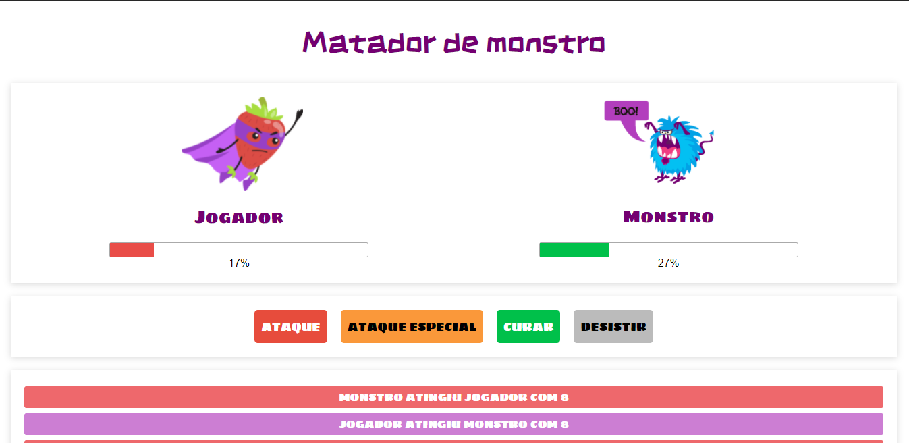

## :game_die: Matador de monstros

#### Repositório para o Projeto 01 - Matador de monstros do curso de VueJS da Cod3r.

---

### :eyes: Para visualizar o projeto
1. Baixe ou clone este repositório
2. Acesse o arquivo index.html

---

### ⚙️ Funcionalidades

- Batalhas com valores de ataque, ataque especial e cura gerados randomicamente. 
- Exibição de resultado de batalhas de acordo com a vida do jogador ou monstro

---

### 🛠 Tecnologias e ferramentas utilizadas
- HTML/CSS
- VueJS
- Google Fonts

---

### 🦸 Autora

Bruna Nunes

---

### 📝 Licença

Este projeto esta sobe a licença [MIT](./license.txt).
